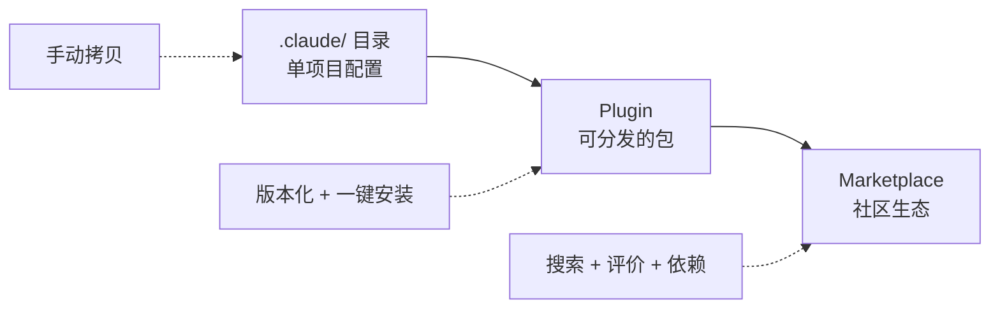

## 前言

如果你已经在用 Claude Code 的 hooks、agents、skills 这些能力，大概率碰到过这些问题：

- 写了一套好用的 code-reviewer agent + 配套 hooks，想给另一个项目用，只能手动拷目录
- 团队里有人搞了一套 MCP server 配置，分享方式是"你去看一下我那个 repo 的 `.claude/` 目录"
- 想把一组相关的能力（skill + hook + agent）打包成一个整体，而不是散落在各处
- 希望有版本管理——"上次那个能用的版本"不该只存在于 git log 的某个 commit 里

Plugin 就是解决这些问题的机制。它把 Claude Code 的各种扩展能力打包成一个**可分发、可版本化、可复用**的单元，像 VS Code extension 之于 VS Code，像 npm package 之于 Node.js。

但 plugin 不只是"把文件搬到一个目录里"。理解它的结构和设计意图，能让你少走很多弯路。

---

## 一、Plugin 到底是什么

一句话：**Plugin 是一个包含 `.claude-plugin/plugin.json` 清单文件的目录，可以向 Claude Code 注入最多十种能力。**

和直接在 `.claude/` 目录下配置相比，plugin 的本质区别在于：

| | 直接配置（`.claude/`） | Plugin |
|---|---|---|
| 技能命名 | `/hello` | `/my-plugin:hello`（命名空间隔离） |
| 适用场景 | 个人/单项目 | 跨项目复用、团队分发 |
| 分发方式 | 手动拷贝 | `claude plugin install` 一行搞定 |
| 版本管理 | 仅靠 git commit | 语义化版本号（semver） |
| 组合性 | 零散文件各自生效 | 一个开关启用/禁用整套能力 |

> **Plugin 不是新能力，是已有能力的打包格式。** 你在 `.claude/` 里能做的一切（hooks、agents、skills、MCP servers……），plugin 都能做——只是多了一层"包装纸"让它能被分发和管理。

---

## 二、目录结构：只有一个文件是必需的

先看全貌，再逐层拆解：

```
my-plugin/
├── .claude-plugin/
│   └── plugin.json          # 唯一必需文件：插件清单
├── skills/                  # 自定义技能（slash commands）
│   └── greet/
│       └── SKILL.md
├── agents/                  # 子代理定义
│   └── code-reviewer.md
├── hooks/                   # 事件钩子
│   └── hooks.json
├── .mcp.json                # MCP 服务器配置
├── .lsp.json                # 语言服务器配置
├── monitors/                # 后台监控
│   └── monitors.json
├── themes/                  # 颜色主题
├── output-styles/           # 输出样式
├── bin/                     # 可执行文件（自动加入 PATH）
├── settings.json            # 默认设置
└── README.md
```

**关键规则：只有 `plugin.json` 放在 `.claude-plugin/` 子目录内，其余所有组件目录都在插件根目录下。** 这是新手最容易搞错的地方——不要把 skills、hooks 之类的东西塞进 `.claude-plugin/`。

而且这些目录全是可选的。一个只提供 hook 的 plugin 不需要 `skills/` 目录，一个只提供 theme 的 plugin 不需要 `agents/` 目录。按需放置，不要留空目录。

---

## 三、plugin.json 清单详解

### 最小可用版本

```json
{
  "name": "my-plugin",
  "description": "一句话说清楚这个插件干什么",
  "version": "1.0.0"
}
```

三个字段就能跑。`name` 是唯一标识符，必须用 kebab-case（如 `code-quality-pack`），因为它会成为命名空间前缀——你的 skill `greet` 在用户那里会变成 `/my-plugin:greet`。

### 完整字段一览

```json
{
  "name": "my-plugin",
  "version": "1.2.0",
  "description": "插件描述",
  "author": {
    "name": "Your Name",
    "email": "you@example.com",
    "url": "https://github.com/you"
  },
  "homepage": "https://docs.example.com/my-plugin",
  "repository": "https://github.com/you/my-plugin",
  "license": "MIT",
  "keywords": ["code-quality", "linting"],

  "skills": "./skills/",
  "commands": ["./commands/special.md"],
  "agents": "./agents/",
  "hooks": "./hooks/hooks.json",
  "mcpServers": "./.mcp.json",
  "lspServers": "./.lsp.json",
  "monitors": "./monitors/monitors.json",
  "themes": "./themes/",
  "outputStyles": "./output-styles/",

  "dependencies": [
    "helper-plugin",
    { "name": "secrets-vault", "version": "~2.1.0" }
  ],

  "userConfig": {
    "api_endpoint": {
      "type": "string",
      "title": "API Endpoint",
      "description": "你的团队 API 地址"
    },
    "api_token": {
      "type": "string",
      "title": "API Token",
      "sensitive": true,
      "description": "认证令牌（存入系统密钥链）"
    }
  }
}
```

几个值得展开说的字段：

**组件路径字段**（`skills`、`agents`、`hooks` 等）：默认情况下 Claude Code 会按约定目录名去找，但你可以通过这些字段指定自定义路径。如果你的项目结构不按约定来，或者一个文件服务多个用途，这就有用了。

**`dependencies`**：声明依赖的其他 plugin。可以只写名字（取最新版），也可以带版本约束。安装时自动解析依赖链。

**`userConfig`**：这个很实用——在用户启用 plugin 时，Claude Code 会自动弹出提示让用户填写这些配置。`sensitive: true` 的值会存入操作系统的密钥链（macOS Keychain / Windows Credential Manager），不会明文写在配置文件里。

**`version`**：省略时，Claude Code 会用 git commit SHA 作为版本标识。但如果你打算发布到 marketplace，建议显式写 semver。

---

## 四、十种可注入的能力

Plugin 能提供的能力不止一种，而是最多十种。逐一拆解：

### 1. Skills（自定义技能）

放在 `skills/<name>/SKILL.md`，用户通过 `/plugin-name:skill-name` 调用。

```markdown
---
description: 用项目规范审查当前改动
disable-model-invocation: false
---

你是一个代码审查助手。请根据以下规范审查当前分支的改动：
1. 检查 API 契约是否被破坏
2. 检查是否有未处理的错误路径
3. 确认测试覆盖率
```

`disable-model-invocation: true` 意味着只有用户手动输入 `/plugin-name:skill-name` 才会触发；设为 `false`（默认）时，Claude 会根据上下文自动判断是否调用这个 skill。

还有一种更简单的形式：`commands/` 目录下的扁平 markdown 文件，一个文件就是一个 skill，不需要嵌套目录。

### 2. Agents（子代理）

放在 `agents/` 目录，每个 `.md` 文件定义一个专用子代理：

```markdown
---
name: security-auditor
description: 安全审计专家，检查代码中的安全隐患
model: sonnet
maxTurns: 20
tools: Read, Grep, Glob, Bash
---

你是安全审计专家。重点关注：
1. SQL 注入和 XSS
2. 硬编码的密钥和凭证
3. 不安全的反序列化

用 `file:line` 格式引用问题位置，每条发现不超过 3 行。
```

frontmatter 支持的字段：`name`、`description`、`model`（sonnet/opus/haiku/inherit）、`maxTurns`、`tools`、`disallowedTools`、`skills`、`memory`、`background`、`isolation`。

### 3. Hooks（事件钩子）

通过 `hooks/hooks.json` 定义，和直接在 settings.json 里写 hooks 语法完全一致：

```json
{
  "hooks": {
    "PostToolUse": [
      {
        "matcher": "Write|Edit",
        "hooks": [
          {
            "type": "command",
            "command": "${CLAUDE_PLUGIN_ROOT}/scripts/auto-format.sh"
          }
        ]
      }
    ]
  }
}
```

注意路径变量 `${CLAUDE_PLUGIN_ROOT}`——这是插件目录的绝对路径，确保不管用户从哪里启动 Claude Code，都能找到你的脚本。

### 4. MCP Servers

通过 `.mcp.json` 配置，plugin 启用时自动启动：

```json
{
  "mcpServers": {
    "my-database": {
      "command": "${CLAUDE_PLUGIN_ROOT}/servers/db-server",
      "args": ["--config", "${CLAUDE_PLUGIN_ROOT}/config.json"]
    }
  }
}
```

### 5. LSP Servers（语言服务器）

通过 `.lsp.json` 配置，提供代码智能（诊断、导航、类型信息）：

```json
{
  "go": {
    "command": "gopls",
    "args": ["serve"],
    "extensionToLanguage": {
      ".go": "go"
    }
  }
}
```

### 6. Monitors（后台监控）

通过 `monitors/monitors.json` 定义，在后台持续运行并投递通知：

```json
[
  {
    "name": "error-log",
    "command": "tail -F ./logs/error.log",
    "description": "应用错误日志监控"
  }
]
```

每一行 stdout 输出会作为一条通知推给 Claude。

### 7. Themes（颜色主题）

放在 `themes/` 目录，JSON 格式：

```json
{
  "name": "Monokai Pro",
  "base": "dark",
  "overrides": {
    "claude": "#a9dc76",
    "error": "#ff6188",
    "success": "#a9dc76"
  }
}
```

安装后在 `/theme` 命令里可以选择。

### 8. Output Styles（输出样式）

放在 `output-styles/` 目录，控制 Claude 回复的格式和风格。

### 9. Default Settings

插件根目录的 `settings.json`，在 plugin 启用时应用：

```json
{
  "agent": "security-auditor",
  "subagentStatusLine": true
}
```

### 10. User Config（用户配置）

在 `plugin.json` 的 `userConfig` 字段中声明，启用 plugin 时自动提示用户填写。在 hook 脚本和 MCP 配置中通过 `${user_config.KEY}` 引用。

---

## 五、三个特殊变量

在 plugin 的脚本、配置文件中可以使用这些变量：

| 变量 | 说明 |
|---|---|
| `${CLAUDE_PLUGIN_ROOT}` | 插件目录的绝对路径。注意：plugin 更新后路径可能变化 |
| `${CLAUDE_PLUGIN_DATA}` | 持久化数据目录，更新后保留。存放缓存、状态文件用这个 |
| `${user_config.KEY}` | 用户在 `userConfig` 中配置的值 |

> **`CLAUDE_PLUGIN_ROOT` vs `CLAUDE_PLUGIN_DATA`**：前者指向插件代码本身，更新后可能指向新目录；后者是专门的数据区，跨版本持久。需要持久化的东西（缓存、状态文件、数据库）一律写 `PLUGIN_DATA`，不要写 `PLUGIN_ROOT`。

---

## 六、从零创建一个 Plugin

### 第一步：搭骨架

```bash
mkdir -p my-plugin/.claude-plugin
mkdir -p my-plugin/skills/greet
mkdir -p my-plugin/agents
mkdir -p my-plugin/hooks
mkdir -p my-plugin/scripts
```

### 第二步：写清单

```bash
cat > my-plugin/.claude-plugin/plugin.json << 'EOF'
{
  "name": "my-plugin",
  "description": "一个演示用的 plugin，包含问候技能和自动格式化",
  "version": "1.0.0",
  "author": {
    "name": "Your Name"
  }
}
EOF
```

### 第三步：添加组件

一个 skill：

```bash
cat > my-plugin/skills/greet/SKILL.md << 'EOF'
---
description: 用项目特定的方式问候用户
---

查看当前项目的 package.json 或 README，了解项目名称和技术栈，
然后用一句话问候用户，并告诉他你能帮他做什么。
EOF
```

一个 agent：

```bash
cat > my-plugin/agents/quick-review.md << 'EOF'
---
name: quick-review
description: 快速审查当前改动
model: sonnet
maxTurns: 10
tools: Read, Grep, Glob, Bash
---

审查当前 git diff 中的改动。关注：
1. 明显的 bug 或逻辑错误
2. 安全隐患
3. 缺失的边界检查

输出格式：每条发现用 `file:line` 引用，不超过 2 行。
EOF
```

一个 hook（写文件后自动格式化）：

```bash
cat > my-plugin/scripts/auto-format.sh << 'EOF'
#!/bin/bash
FILE_PATH=$(jq -r '.tool_input.file_path // empty')

if [[ "$FILE_PATH" == *.ts || "$FILE_PATH" == *.tsx || "$FILE_PATH" == *.js ]]; then
  npx prettier --write "$FILE_PATH" 2>/dev/null
fi
exit 0
EOF
chmod +x my-plugin/scripts/auto-format.sh

cat > my-plugin/hooks/hooks.json << 'EOF'
{
  "hooks": {
    "PostToolUse": [
      {
        "matcher": "Write|Edit",
        "hooks": [
          {
            "type": "command",
            "command": "${CLAUDE_PLUGIN_ROOT}/scripts/auto-format.sh"
          }
        ]
      }
    ]
  }
}
EOF
```

### 第四步：本地测试

```bash
# 不需要安装，直接加载目录
claude --plugin-dir ./my-plugin

# 在会话中验证
/my-plugin:greet        # 测试 skill
/hooks                  # 确认 hook 已加载
```

多个 plugin 可以同时加载：

```bash
claude --plugin-dir ./plugin-a --plugin-dir ./plugin-b
```

开发过程中修改了 plugin 内容，不需要重启，在会话中输入：

```
/reload-plugins
```

### 第五步：发布或分发

```bash
# 发布到 marketplace（需要先配置）
claude plugin tag

# 或者直接让别人从 git 安装
# 只要 repo 根目录符合 plugin 结构就行
```

---

## 七、安装与管理

```bash
claude plugin install <name>                    # 从 marketplace 安装
claude plugin install <name>@<marketplace>      # 从指定 marketplace 安装
claude plugin install <name> --scope project    # 安装到项目级（提交到 git）

claude plugin list                              # 列出已安装的 plugin
claude plugin enable <name>                     # 启用
claude plugin disable <name>                    # 禁用（不卸载）
claude plugin update <name>                     # 更新到最新版
claude plugin uninstall <name>                  # 卸载
claude plugin prune                             # 清理孤立依赖
```

### 三个安装作用域

| 作用域 | 配置文件 | 提交到 git | 适用场景 |
|---|---|---|---|
| `user` | `~/.claude/settings.json` | 否 | 个人工具，所有项目生效 |
| `project` | `.claude/settings.json` | 是 | 团队共享，新人 clone 即用 |
| `local` | `.claude/settings.local.json` | 否（gitignored） | 个人实验、敏感配置 |

还有一个 `managed` 作用域，由组织管理员通过管理策略（Managed Policy）强制下发，个人不能禁用。

安装后在 settings.json 中体现为：

```json
{
  "enabledPlugins": {
    "my-plugin": true
  }
}
```

---

## 八、实战：一个团队级代码质量 Plugin

把前面的零散知识串起来，看一个更完整的例子——一个团队共享的代码质量 plugin：

```
code-quality-pack/
├── .claude-plugin/
│   └── plugin.json
├── skills/
│   └── review/
│       └── SKILL.md            # /code-quality-pack:review
├── agents/
│   ├── security-auditor.md     # 安全审计
│   └── perf-reviewer.md        # 性能审查
├── hooks/
│   └── hooks.json              # 写文件后 lint + 提交前检查
├── scripts/
│   ├── post-write-lint.sh
│   └── pre-commit-check.sh
└── .mcp.json                   # 连接 SonarQube 之类的代码质量平台
```

`plugin.json`：

```json
{
  "name": "code-quality-pack",
  "description": "团队代码质量工具包：自动 lint、安全审计、性能审查",
  "version": "2.1.0",
  "author": { "name": "Platform Team" },
  "keywords": ["quality", "security", "lint"],
  "userConfig": {
    "sonar_token": {
      "type": "string",
      "title": "SonarQube Token",
      "sensitive": true,
      "description": "用于连接团队 SonarQube 实例"
    }
  }
}
```

团队成员使用时：

```bash
# 安装到项目级，提交到 git
claude plugin install code-quality-pack --scope project

# 首次启用时自动提示输入 SonarQube token
# token 存入系统密钥链，不会出现在配置文件中
```

这就是 plugin 的核心价值——**一次封装，团队复用，一行安装，版本可控。**

---

## 九、几个容易踩的坑

1. **组件目录的位置**：所有组件目录（skills、agents、hooks……）在插件根目录下，不在 `.claude-plugin/` 里。`.claude-plugin/` 只放 `plugin.json`。

2. **命名空间**：plugin 里的 skill 名字会加前缀。你定义的 `greet` 对用户来说是 `/my-plugin:greet`，不是 `/greet`。设计 skill 名字时考虑到这一层。

3. **路径引用**：hook 脚本里引用 plugin 内的文件，用 `${CLAUDE_PLUGIN_ROOT}` 而不是相对路径。用户的工作目录和你的插件目录不在同一个地方。

4. **持久化数据**：要持久存储的东西写 `${CLAUDE_PLUGIN_DATA}`，不要写 `${CLAUDE_PLUGIN_ROOT}`。后者在 plugin 更新时可能指向新目录，老数据就丢了。

5. **`sensitive` 配置**：`userConfig` 里标 `sensitive: true` 的值会进系统密钥链。如果你的 plugin 需要 API token 之类的凭证，务必用这个机制，不要让用户把 token 写在明文配置里。

---

## 收尾：Plugin 是 Claude Code 生态的"npm"

回顾一下 plugin 的定位：



这条路径和前端生态的演进一模一样：从手动拷贝 jQuery 文件，到 npm install，到 npmjs.com 上有星标和下载量。

Plugin 系统让 Claude Code 的扩展能力从"个人作坊"走向"团队标准化"。你写的每一个好用的 hook、每一个精心调教的 agent、每一套 MCP server 配置，都可以打包成 plugin，变成团队——甚至社区——的共享资产。

> **工具的价值不只在于它能做什么，更在于它的能力能不能被积累和传播。Plugin 就是这个积累和传播的载体。**

---

*参考文档：*

- [Plugins overview - Claude Code](https://docs.anthropic.com/en/docs/claude-code/plugins)
- [Creating plugins - Claude Code](https://docs.anthropic.com/en/docs/claude-code/plugins/creating-plugins)
