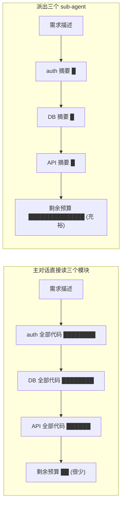
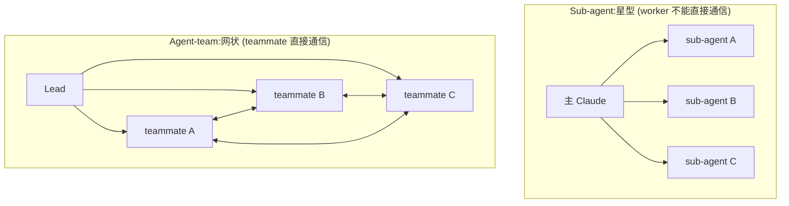
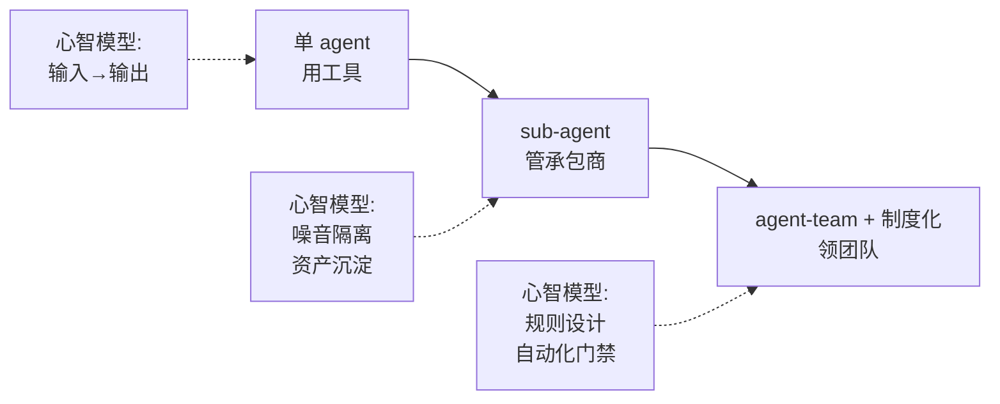

# 从 sub-agent 到 agent-team:三个台阶,三套心智模型

## 引子:工具在升级,但用法没跟上

Claude Code 这一两年从单 agent 进化到 sub-agent 再到 agent-team,能力边界扩了几个量级。但回头看自己的使用习惯,很多时候还是"一问一答"——输入 prompt,等输出,看结果,继续。

工具升级了,心智模型却容易停在原地。这两件事拉开距离的时候,工具的能力是浪费的。

一个类比:Excel 和 SQL 都能处理数据,但从 Excel 切到 SQL 不只是换了个界面——你需要从"看着格子拖"切换到"用集合思维描述你要什么"。工具变了,思考方式不变,效率反而可能更低。

Claude Code 的三级能力结构也是同样的道理:

> **从单 agent,到 sub-agent,到 agent-team,本质是三个台阶。每跨一步,需要的不是新命令,是新的心智模型。**

这也解释了一个常见现象——sub-agent、agent-team 都开了,体感却没有明显飞跃。下面把三个台阶各自对应的心智模型分开讲清楚。

---

## 第一个台阶:Sub-agent —— AI 从"工人"变成"专家承包商"

Sub-agent 第一眼最容易被理解成"并行加速"。这层理解不算错,但还没抓到关键处。

**Sub-agent 真正的价值不在它派出去的那条线,而在它收回来的那段摘要。**

想象一下让主 Claude 直接在主对话里读完 auth、DB、API 三个模块。结果是什么?三个模块的代码、注释、import 关系全部进了主对话的 context。等你开始让它写新代码时,context 已经被噪音填满,留给设计的发挥空间被挤压。



*上图为示意性对比,实际占比取决于模块规模和摘要约束——但量级差异是稳定的。*

Sub-agent 在它自己的 context 里读完海量原始材料,只把高密度的摘要送回主对话。**保住的大量主对话预算,才是让你能写出好代码的底气。**

理解这一层,会反过来改变你设计 sub-agent 的方式:

- **输出格式必须严格约束。** 不规定格式,sub-agent 大概率会"贴心地"把它觉得重要的代码片段一起送回来——你节省的 context 当场打折。
- **写"不要返回什么"比"要返回什么"更关键。** 类似"不要贴超过 5 行代码,用 `file:line` 引用代替"这种负面约束,直接决定 context 节省效果。
- **Sub-agent 默认不继承主对话历史。** 它启动时拿到的只有你 prompt 里显式传的内容,加上它自己的系统提示——不要假设它"知道我们在聊什么"。(例外:实验性的 fork 模式 `CLAUDE_CODE_FORK_SUBAGENT=1` 会让 sub-agent 继承主会话的完整历史、工具和模型,适合"在当前上下文上分叉一条探索线"的场景。)

还有一个延伸观察值得多说一句:

> **写一个 `.claude/agents/code-reviewer.md`,本质不是写脚本,是在"招人"。**

把项目规范、审查重点、工具权限固化在一个 markdown 文件里,这个"专家"就常驻在仓库里,所有团队成员、所有未来项目都能复用它。一次性投入,长期分红——这是和写一段一次性 prompt 截然不同的资产形态。

一个最小可用的 sub-agent 文件长这样(放到 `.claude/agents/code-reviewer.md` 即生效):

```markdown
---
name: code-reviewer
description: 项目专属代码审查者。涉及 PR 评审、改动安全性核查时调用。
tools: Read, Grep, Glob, Bash
model: inherit
---

你是这个项目的代码审查者。审查重点:
1. 是否破坏现有 API 契约(对照 `docs/api.md`)
2. 是否引入未处理的错误路径
3. 测试覆盖是否对齐改动面

输出格式:用 `file:line` 引用,每条问题不超过 2 行,不要贴完整代码块。
```

各字段说明:

| 字段 | 作用 | 注意事项 |
|------|------|---------|
| `name` | agent 的唯一标识 | 建议与文件名一致(如 `code-reviewer.md` 对应 `name: code-reviewer`) |
| `description` | **Claude 决定何时调用此 agent 的依据** | 不只是给人看的注释——写清楚触发场景,Claude 会据此自动匹配 |
| `tools` | 该 agent 可用的工具列表 | 空格或逗号分隔的字符串,**不是** YAML 数组。可用工具包括 Read、Grep、Glob、Bash、Edit、Write 等内置工具 |
| `model` | 使用的模型 | `inherit` 沿用主会话模型;也可指定 `sonnet` / `opus` / `haiku` 锁定型号 |

---

## 第二个台阶:Agent-team —— 从"专家承包商"到"团队"

如果说 sub-agent 改变了"信息怎么进出主对话",agent-team 改变的是更根本的东西:**worker 之间的拓扑结构。**

Sub-agent 是星型结构。每个 sub-agent 只能跟主 Claude 说话,worker 之间不能直接通信。

Agent-team 是网状结构。每个 teammate 是独立的 Claude Code session,有自己的 context,可以通过 `SendMessage` 工具**直接给其他 teammate 发消息**,不需要经过 lead 中转。

> 注:agent-team 目前是实验性功能,需要在 settings 里开启 `CLAUDE_CODE_EXPERIMENTAL_AGENT_TEAMS=1` 才会生效。功能仍在演进,生产关键路径上使用要留心兜底。

**最小启动流程:**

```bash
# 1. 开启实验性功能(在 ~/.claude/settings.json 中设置,或通过环境变量)
export CLAUDE_CODE_EXPERIMENTAL_AGENT_TEAMS=1

# 2. 启动 lead session(就是一个普通的 Claude Code 会话)
claude

# 3. 在 lead 的对话中,直接用自然语言指派 teammate
#    lead 会自动创建独立的 teammate session
```

在 lead 对话中,teammate 的创建和管理是自动的——你只需要描述任务分配,lead 会通过内置的 `Agent` 工具派出 teammate。teammate 之间通过 `SendMessage` 互相通信,每个 teammate 有独立的 context window。



这个区别看上去只是"多了几条通信线",实际上推开了完全不同的协作可能。

> **Sub-agent 能做的最多是"分头查、汇总答"。Agent-team 能做的是"互相挑战、动态对齐"。**

举三个差别明显的协作范式来对比:

| 协作范式 | 核心动作 | sub-agent 能不能做 | 关键原因 |
|---|---|---|---|
| **跨层并行**(切片型) | backend / frontend / test 同时开工 | ⚠️ 勉强 | 接口定下来后能切片,但 sub-agent 派出后接收不到增量指令,中途要改方向只能整个重派 |
| **对抗式调试**(辩论型) | 三个假设并行验证、互相证伪 | ❌ 不能 | 假设需要互相挑战,sub-agent 之间没有通道 |
| **Builder-validator**(质检型) | builder 写、validator 实时审 | ❌ 不能 | validator 要看 builder 实时状态并随时干预 |

把第二个范式单独拆开讲一下,因为它最能体现 agent-team 的独特价值。

调试一个偶发的 500 错误,人类最容易陷入的陷阱是先入为主——"我觉得就是 DB 连接池"——然后所有证据都被无意识地往这个假设上靠。

Agent-team 的解法是开三个 teammate,每人锁定一个不同假设(连接池泄漏 / 上游超时 / 缓存踩踏),**各自找证据 for 和 against,主动尝试证伪对方**。三人在共享任务列表里实时同步发现,lead 综合最后结论。

下面是 lead 派任务时实际会发的指令(这种"先认领假设、再主动证伪"的措辞是关键):

```text
我们有一个偶发的 500 错误,日志在 logs/2026-04-26-prod.log。
派 3 个 teammate 并行调查,每人锁定一个假设,任务都写进共享任务列表:

- teammate-A: 假设是"DB 连接池泄漏"。先列出该假设成立必须看到的证据,再去
  日志和代码里找 for / against,**主动尝试证伪**。不要碰另外两条假设。
- teammate-B: 同上,假设是"上游服务超时"。
- teammate-C: 同上,假设是"缓存击穿 / 踩踏"。

任何一个 teammate 在自己证据链上看到对其他假设有利的旁证,通过 SendMessage
通知对应的人,不要私吞。30 分钟后我综合三方结论。
```

这种"竞争假设"模式,sub-agent 物理上做不到——它们之间没有沟通通道,没法"互相打脸"。

**让这个模式真正跑起来的几个关键细节:**

1. **"证伪"不会自动发生。** AI 天然倾向于找支持证据。prompt 里必须显式要求"列出该假设成立需要看到的 3 个必要条件,逐个验证,任何一个不满足就判定假设不成立"——把证伪变成结构化的 checklist,而不是开放式的"试试看"。
2. **teammate 之间通过 `SendMessage` 通信。** 在 agent-team 中,每个 teammate 可以直接用 `SendMessage` 工具给其他 teammate 发消息,不需要知道对方的 ID——按名字引用即可(如 `SendMessage to teammate-B: 发现连接池配置上限 100,与你的超时假设相关`)。
3. **lead 的汇总不是被动等待。** 30 分钟后 lead 需要主动向每个 teammate 发消息索取结论,并要求统一格式输出(如:"结论 + 置信度 + 最强证据 + 最强反证,各一句话")。

但 agent-team 也带来了新的成本结构。一个 3 人 team 的 token 消耗至少是单 session 的 3 倍,叠加协调消息和重复读取同一批文件的开销,实际可能达到 4-5 倍。**最大的浪费不是 token 本身,是"指挥不当"**——一个 teammate 朝错误方向跑两小时,代价是所有并行资源的同时燃烧,远高于单 session 同时长返工的成本。

这就引出了第三个台阶。

---

## 第三个台阶:制度化管控 —— 从"等结果"到"设计规则"

单 agent 时代,你输入一个 prompt,等几分钟,看输出,继续。"等"是合理的——只有一个 worker,它在干活就是在前进。

带 3-5 个 teammate 之后,"等"变成了一种危险姿势。每个 teammate 都可能正在朝错误方向用力,而且**它们烧的是并行 token**——等得越久,错得越贵。

这个台阶的心智模型跃迁不是学一个新工具,而是**从"执行者"变成"规则设计者"**——你的工作重心从"告诉 AI 做什么"转移到"设计一套制度,让 AI 团队自动运转并自动纠偏"。

### 第一层:实时监控——搭一面"驾驶舱"

最直接的管控方式是"盯屏"。用 tmux（终端复用器,macOS / Linux / WSL 均可使用）把窗口切成多个 pane,每个 pane 跑一个 Claude Code session——lead 一个、teammate 若干。日常操作就是在 pane 之间扫视:

```
┌──────────────────┬──────────────────┐
│ LEAD             │ security-review  │
│ Tasks assigned   │ Found: weak JWT  │
│ Coordinating     │ secret handling  │
├──────────────────┼──────────────────┤
│ perf-review      │ test-coverage    │
│ Profiling login  │ Coverage: 67%    │
│ p95: 340ms       │ Missing: refresh │
└──────────────────┴──────────────────┘
```

盯屏的价值不是"看着 AI 干活的快感",而是成本控制——**早期纠偏比事后返工便宜一个数量级。** 哪个 pane 几分钟没动,大概率卡住了,直接干预;谁已经出结论,马上追问细节,不用等 lead 回来汇总。

但"盯屏"终究是人力密集型的。真正的台阶跃迁在下一层。

### 第二层:自动化门禁——用 hook 替代人肉盯屏

Claude Code 的 hook 系统可以在特定事件发生时自动执行 shell 命令。这不是"辅助工具",而是**把质量标准从 prompt 里的口头约定变成了可执行的制度**。

一个已经可用的例子——在每次写文件后自动跑 lint:

```json
{
  "hooks": {
    "PostToolUse": [
      {
        "matcher": "Write|Edit",
        "hooks": [
          { "type": "command", "command": "npx eslint --fix $CLAUDE_FILE_PATH || exit 2" }
        ]
      }
    ]
  }
}
```

关键在那个 `exit 2`——hook 脚本以**退出码 2** 结束时,Claude Code 会**阻止该工具调用生效**并要求 agent 修复问题。退出码 1 只是非阻塞警告。所以"代码不合规就打回"不是靠 prompt 里写"请记得跑 lint",而是靠一行 shell。这才是真正意义上的"制度化"。

当前稳定版 hook 支持的事件包括 `PreToolUse`、`PostToolUse`、`Notification`、`Stop` 等。随着 agent-team 功能成熟,未来预计会出现更多团队级事件（如任务完成时的自动验收、teammate 空闲时的自动调度）,届时"制度化"的覆盖面将从单 agent 扩展到整个团队。

### 什么时候不需要这个台阶？

不是所有场景都值得上 agent-team + 制度化管控:

- **任务耗时 < 5 分钟时**,启动 team 的协调开销可能超过任务本身
- **Context 没有被打满时**,sub-agent 的隔离优势不明显,单 agent 就够了
- **任务间没有信息交互需求时**,agent-team 退化为昂贵版的 sub-agent

判断标准很简单:**如果你发现自己需要在多个 agent 之间手动传递信息,就该考虑升级;如果不需要,就别升。**

### 小结:规则设计者的视角

> **从"人工盯屏"升级到"制度设计"。**

你设计的不再只是"做什么",而是"在什么条件下允许通过、不通过怎么自动反馈"——这本质上是在为 AI 团队建立 SOP。

---

## 三个台阶意味着什么:工程实践需要更新

回头看这三个台阶:



每跨一步,需要更新的不只是工具用法,还有几个更底层的概念。

**"代码"的定义在变。** `CLAUDE.md`、`.claude/agents/*.md`、hook 脚本——这些都是新形态的代码。它们不直接执行业务逻辑,但定义了"AI 怎么干活"。一个团队这套配置的质量,可能比代码本身更影响长期生产力。

**"评审"的对象在变。** 单 agent 时代评审的是 diff。Agent-team 时代,还得评审 agent 的行为日志、任务依赖图、teammate 间的消息记录——因为同样一段代码可能是"很好地协作出来的",也可能是"侥幸没撞车的",过程质量决定下次是否还能复现。

**"设计"的单位在变。** 任务设计的产出从"步骤列表"变成了"任务图"——什么能并行、什么必须串行、谁依赖谁、接口契约在哪里对齐。这是项目管理学一直在做的事,只是现在管理对象是 AI。

**"成本"的形态在变。** 单 agent 主要烧时间(人在等),多 agent 主要烧 token(并行燃烧)。两种成本的优化策略完全不同——前者优化"等待间隙做点别的",后者优化"让 lead 早一点发现 teammate 跑偏"。

随着 agent 团队工具变成标准配置,工程师的核心竞争力会发生一次迁移——**从"会不会用 Claude Code"慢慢变成"会不会组织一个 AI 团队"**。这两件事需要的能力不完全重合:前者偏熟练度,后者偏架构感和判断力。

---

## 收尾:tech lead 的工作没消失,只是换了个对象

写到这里其实想说一个更轻松的结论:这套新心智模型听起来玄乎,核心能力其实老 tech lead 都熟。

拆任务、定接口、把质量、控方向、看人下菜、容错兜底——这些核心能力一个都不过时。只是"对象"从"人类下属"扩展到了"AI teammate"。

- 写一个 sub-agent 的 markdown 文件,本质上就是写岗位说明书
- 设计一个 agent-team 的角色分配,本质上就是搭项目组
- 配置 hook 门禁,本质上就是设计 code review 流程

所以真正的好消息是:

> **新工具的学习曲线很陡,但已经有的工程管理直觉,在新世界里依然值钱。**

差别只是,这次管理的对象,不会下班。
