# Hermes Agent：从智能助手到可持续进化的个人代理系统

> 本课题是一份面向学习者、开发者和 AI Agent 产品设计者的教材式导论。它不把 Hermes 仅仅介绍成一个命令行聊天工具，而是把它放在“AI Agent 如何从一次性问答，走向长期协作、工具执行、跨平台交付和自我改进”的大背景下理解。

## 学习目标

学完本课题后，你应该能够回答六个问题：

1. Hermes Agent 是什么，它和普通聊天机器人、IDE 助手、自动化脚本有什么根本差异。
2. 为什么现代 AI Agent 需要工具、记忆、技能、会话、平台网关、定时任务和插件系统。
3. Hermes 的核心架构如何运转：入口层、AIAgent 循环、模型路由、工具运行时、会话存储、消息网关、Cron、技能与记忆。
4. Hermes 能做什么：代码开发、研究整理、网页与浏览器自动化、多平台聊天、定时报告、文件操作、语音、图像、MCP 集成、插件扩展、子代理并行。
5. Hermes 主要解决哪些问题：上下文断裂、模型锁定、工具碎片化、跨设备协作困难、自动化不可持续、经验无法沉淀、Agent 难以部署与运维。
6. 如何判断一个场景适不适合用 Hermes，以及使用 Hermes 时应当注意哪些边界和安全问题。

## 一句话定义

**Hermes Agent 是一个由 Nous Research 构建的、自带工具系统、持久记忆、技能库、消息网关、定时任务和自我改进循环的通用 AI Agent 运行环境。**

更直白地说，它不是“一个模型”，也不是“一个聊天窗口”。它更像是一个可以连接不同大模型、不同工具、不同终端环境、不同聊天平台和不同知识技能的代理操作系统：

- 你可以在终端里和它协作。
- 你可以在 Telegram、Discord、Slack、WhatsApp、Signal、飞书、企业微信、邮件等平台上和它对话。
- 你可以让它执行终端命令、读写文件、浏览网页、调用浏览器、使用 MCP 服务器、运行代码、生成图片、处理语音。
- 你可以让它记住你的偏好、项目习惯、过去会话和可复用流程。
- 你可以让它把复杂任务沉淀成 Skill，并由后台 Curator 周期性整理技能库。
- 你可以把它部署在本机、服务器、Docker、SSH、Modal、Daytona、Vercel Sandbox 等不同运行环境中。

如果把普通聊天机器人比作“可以回答问题的人”，那么 Hermes 更接近“可以长期跟你共事的 AI 工作台”。

## 背景：为什么需要 Hermes 这样的系统

### 第一阶段：聊天式 AI 的能力边界

大模型最早被大量使用时，用户主要通过一个聊天框获得帮助。这个阶段的核心交互模式是：

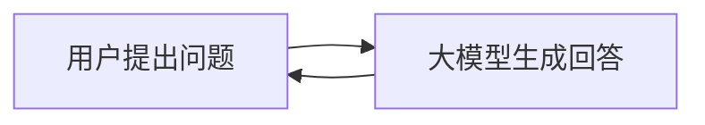

这种模式已经很强，但它有明显边界：

| 问题 | 表现 | 结果 |
|---|---|---|
| 不能真实行动 | 模型只能“建议你运行命令”，不能自己完成完整操作 | 用户仍然承担大量机械步骤 |
| 没有稳定环境 | 每次会话都像重新认识用户和项目 | 上下文重复解释，协作成本高 |
| 工具能力割裂 | 网页搜索、文件系统、代码执行、浏览器、数据库分别在不同软件里 | 复杂任务被迫手工搬运 |
| 缺少长期记忆 | 模型很难可靠记住用户偏好、项目结构和历史决策 | 经验无法复用 |
| 难以自动化 | 需要定时执行、监控、通知的任务无法自然表达 | 用户仍要写脚本、配 cron、接 webhook |
| 平台受限 | AI 通常绑定在一个网页、一个 IDE 或一台电脑上 | 你离开电脑后，Agent 就失去触达能力 |

换句话说，聊天式 AI 解决了“生成答案”的问题，但没有完整解决“完成工作”的问题。

### 第二阶段：工具增强 Agent

后来，Agent 开始拥有工具调用能力。模型可以搜索网页、读文件、写代码、运行测试、操作浏览器。这时交互模型变成：

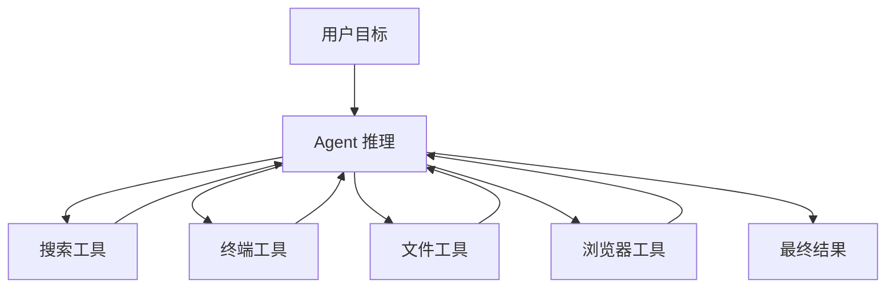

工具让模型从“给建议”变成“能行动”。但新的问题也出现了：

- 工具越多，权限、安全和可观测性越重要。
- 任务越长，会话、上下文压缩和历史检索越重要。
- 用户越依赖 Agent，记忆和个性化越重要。
- 场景越多，平台适配、插件、MCP 和工具集配置越重要。
- Agent 越常用，技能沉淀和自我改进越重要。

Hermes 的出现，可以理解为对这些问题的一次系统化回答。

### 第三阶段：可持续协作的 Agent 系统

Hermes 关注的不是“单次调用一个模型”，而是“让一个 Agent 长期生活在用户的工作流里”。它要处理的不只是推理，还有：

- **入口**：用户从终端、TUI、聊天平台、API、IDE、批处理进入。
- **模型**：用户可以选择不同 Provider 和模型，并支持 fallback。
- **上下文**：项目说明、用户记忆、会话历史、技能说明需要被组织进 prompt。
- **工具**：工具要能注册、分组、过滤、调用、记录和扩展。
- **环境**：工具要能在本地、容器、远端、云沙盒等环境运行。
- **安全**：终端命令、文件访问、网关用户、插件加载都需要约束。
- **自动化**：Agent 要能按计划运行，并把结果送回合适平台。
- **成长**：完成任务后，要能决定哪些经验应该保存成记忆或技能。

因此，Hermes 的核心价值不是“又多了一个 AI 客户端”，而是给 Agent 提供了一套长期运行所需的基础设施。

## Hermes 的整体架构图

下面这张图是理解 Hermes 的第一张地图：

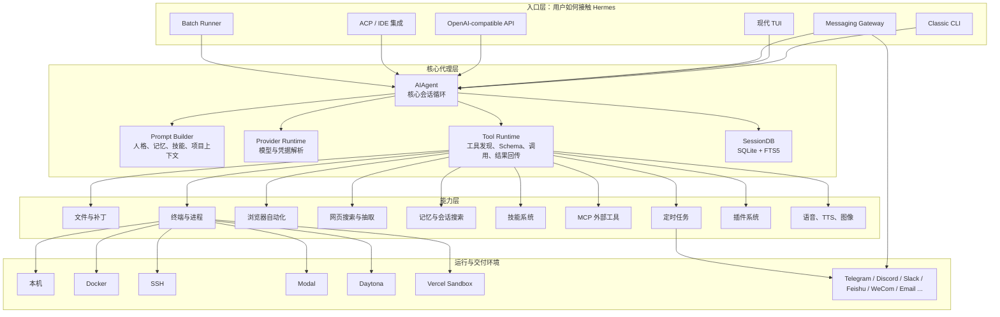

这张图有一个重要含义：Hermes 不是单层应用，而是多层系统。它把“用户入口、模型推理、上下文管理、工具调用、运行环境、消息交付、长期记忆”拆成不同层，每层都可以扩展。

## Hermes 是什么：四个视角

### 视角一：它是一个终端 AI 工作台

从最简单的使用方式看，Hermes 是一个命令行 Agent：

```bash
hermes
hermes --tui
hermes chat -q "帮我总结这个项目的结构"
hermes chat --model "anthropic/claude-sonnet-4"
hermes chat --toolsets "web,terminal,skills"
```

它支持多行输入、会话恢复、slash command、技能预加载、模型切换、语音输入、工具进度展示、上下文压缩和 token/cost 状态栏。

这让 Hermes 适合开发者日常使用：你可以在项目根目录启动 Hermes，让它读取项目上下文、运行命令、修改文件、检查测试、写文档、做代码审查。

### 视角二：它是一个跨平台消息机器人

Hermes 的 Messaging Gateway 让同一个 Agent 可以出现在多个聊天平台中：

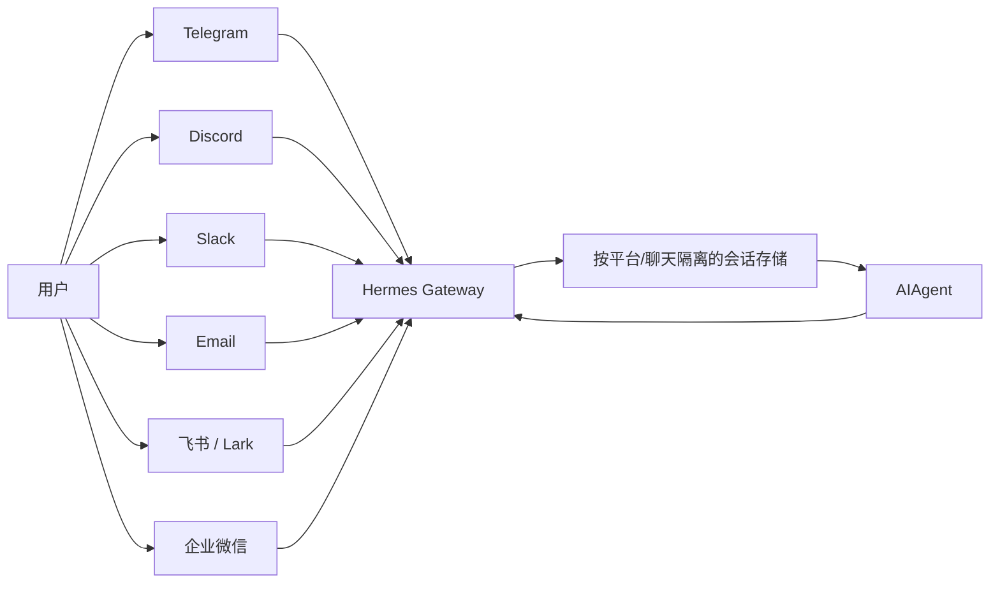

这解决了一个非常现实的问题：工作不是只发生在 IDE 里。你可能在手机上想到一个任务，在 Slack 里收到一个问题，在 Telegram 里想看服务器状态，在邮件里想让 Agent 帮你分析附件。Hermes 把这些入口统一到一个 Agent 后端。

### 视角三：它是一个工具运行时

Hermes 内部有工具注册、工具集、工具可用性检查、工具调用分发、环境后端和结果回传机制。工具类别包括：

| 类别 | 典型能力 |
|---|---|
| Web | 搜索网页、抽取页面内容 |
| Terminal & Files | 执行命令、管理进程、读写文件、应用补丁 |
| Browser | 打开网页、点击、输入、截屏、视觉识别 |
| Media | 图像理解、图像生成、TTS、语音转写 |
| Agent orchestration | Todo、澄清问题、执行代码、子代理委派 |
| Memory & recall | 写入记忆、检索历史会话 |
| Automation & delivery | 创建定时任务、发送消息 |
| Integrations | MCP、Home Assistant、Spotify、Discord 等 |

普通脚本通常是“人写死流程”。Hermes 的工具运行时则是“模型根据目标动态选择工具”，这让它能处理开放式任务。

### 视角四：它是一个自我改进系统

Hermes 的一个关键定位是 self-improving agent。它有三类长期学习机制：

1. **Memory**：保存用户偏好、环境事实、项目习惯。
2. **Session Search**：用 SQLite + FTS5 检索过去会话。
3. **Skills**：把非平凡流程沉淀为可复用知识文档，并可由 Curator 整理。

这和普通“保存聊天记录”不同。保存聊天记录只是留档，而 Hermes 的目标是把经历变成下一次可直接使用的能力。

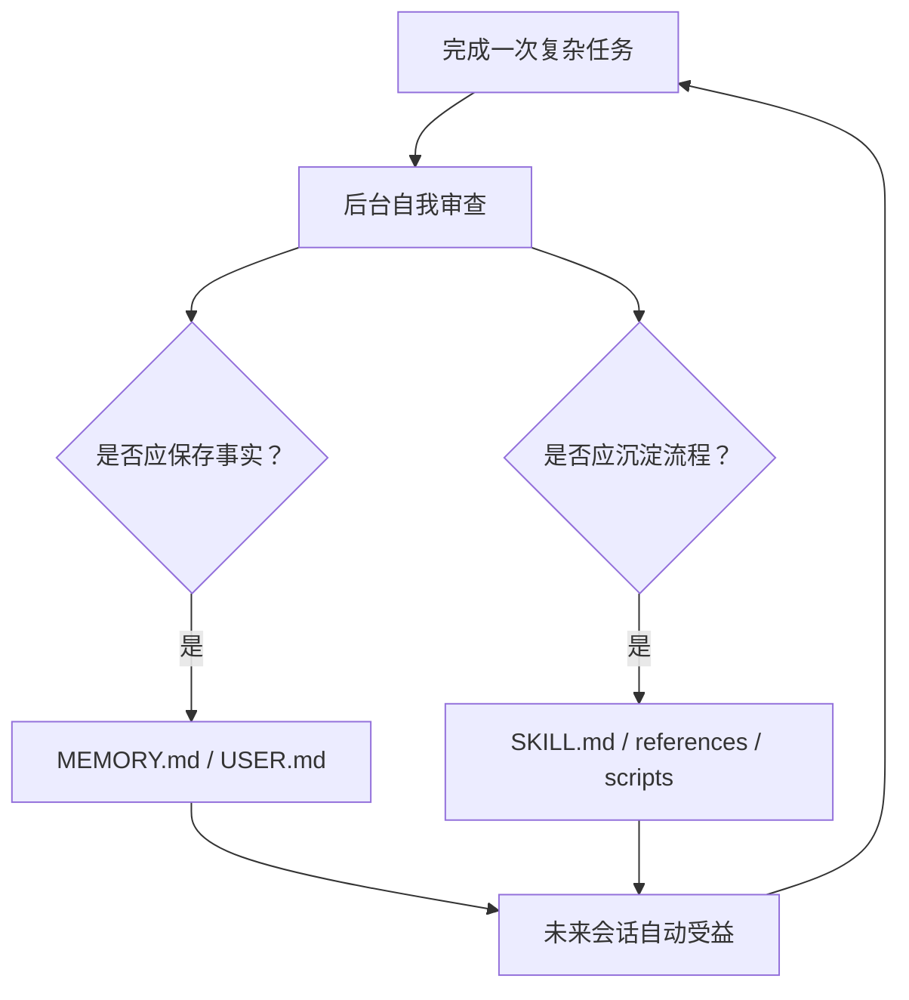

这个闭环让 Hermes 更接近“不断积累经验的协作者”，而不是“每次从零开始的聊天窗口”。

## Hermes 的核心工作流

### 一个普通对话回合发生了什么

当你向 Hermes 发一条消息时，内部流程大致如下：

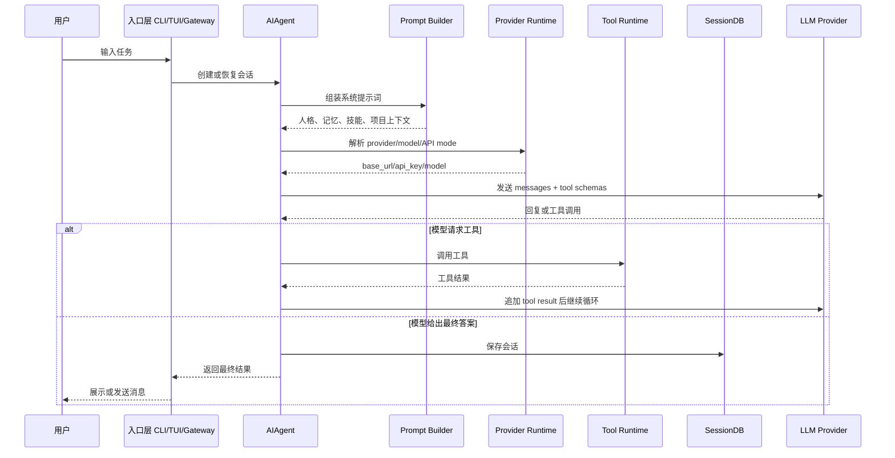

这说明 Hermes 的“智能”不是只在模型本身，而是在模型与工具、上下文、状态、交付层之间的循环中产生。

### 上下文如何进入 Agent

Hermes 的上下文不是简单把所有东西塞给模型。它会按用途分层：

| 上下文来源 | 用途 | 特点 |
|---|---|---|
| SOUL.md | 定义 Agent 的人格、语气和基本行为 | 全局加载 |
| MEMORY.md | Agent 对环境、项目、经验的个人笔记 | 有字符上限，保持精炼 |
| USER.md | 用户偏好、沟通风格、身份信息 | 有字符上限 |
| AGENTS.md / .hermes.md / CLAUDE.md | 项目规则、结构、约束 | 按项目发现 |
| Skills | 特定任务的可复用流程 | 按需加载 |
| Session history | 当前会话上下文 | 可压缩 |
| Session search | 过去会话检索 | 需要时调用 |

这种设计背后的原则是：**不同类型的信息应该进入不同的记忆层**。不是所有内容都适合常驻系统提示词，也不是所有经验都应该埋在聊天记录里。

## Hermes 为什么需要这些模块

### 为什么需要多 Provider

现实中没有一个模型永远最合适：

- 有的模型推理强，但贵。
- 有的模型快，但上下文短。
- 有的模型适合代码，有的适合视觉，有的适合中文。
- 有的服务偶尔限流或故障。
- 团队可能有自己的 OpenAI-compatible endpoint。

Hermes 通过 provider runtime 把模型选择从业务逻辑里抽出来。用户可以通过 `hermes model`、配置文件或命令参数切换 provider/model，而不是改代码。

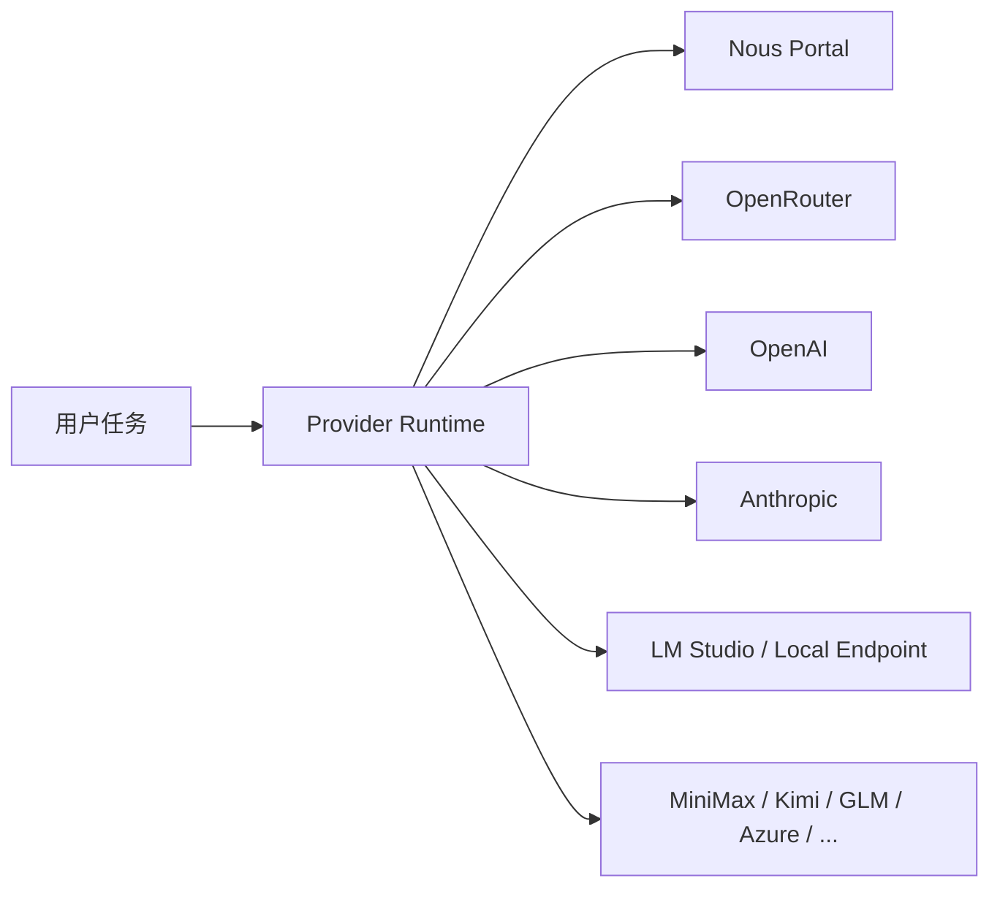

这解决的是模型时代最重要的工程问题之一：避免把 Agent 的能力绑定死在某一家模型供应商上。

### 为什么需要工具集

工具越多，模型的选择空间越大，但风险也越大。工具集的作用是把工具按场景组织起来：

- CLI 可以启用文件、终端、浏览器、技能。
- 消息平台可以限制危险工具。
- Cron 任务可以附加特定技能。
- 子代理可以被限制在更窄的工具范围内。

这不是单纯的“开关功能”，而是 Agent 权限模型的一部分。一个会发 Slack 消息的 Agent 和一个能执行 shell 的 Agent，风险等级完全不同。

### 为什么需要记忆

没有记忆的 Agent 会反复问同样的问题：

- 你喜欢详细解释还是简洁答案？
- 这个项目怎么跑测试？
- 你用 zsh 还是 fish？
- 这个仓库有哪些禁忌？
- 上次我们为什么选择这个方案？

Hermes 的记忆不是无限制堆积，而是有明确容量的 curated memory。它强迫 Agent 只保存重要、稳定、可复用的信息。

可以把记忆分成两层：

| 层 | 适合保存什么 | 不适合保存什么 |
|---|---|---|
| MEMORY.md / USER.md | 高频、稳定、会反复影响行为的信息 | 大段日志、临时路径、一次性数据 |
| Session Search | 过去讨论过的具体问题、细节、决策过程 | 每次都必须立即可见的偏好 |

### 为什么需要技能

记忆保存“事实”，技能保存“流程”。

例如：

- “用户使用 macOS + zsh”是记忆。
- “如何在这个团队里发布一个 npm 包”是技能。
- “这个项目测试命令是 `pytest tests/`”是记忆。
- “遇到 flaky test 时按哪些步骤定位”是技能。

Hermes 的 Skill 本质上是可加载的操作手册。它可以包含主说明、references、templates、scripts 和 assets。模型不需要每次从零发明流程，而是按需加载经过沉淀的步骤。

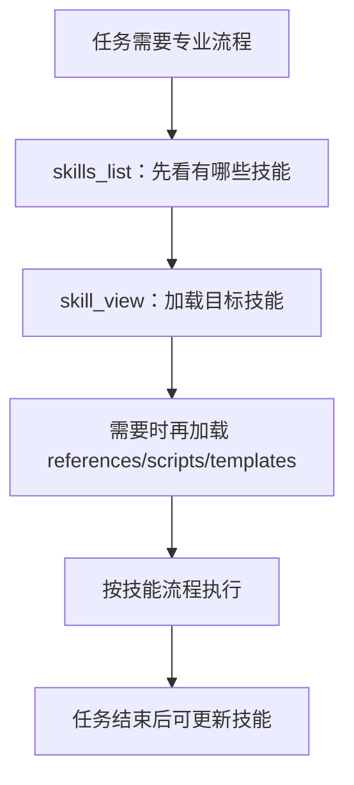

这就是 Hermes 所说的 procedural memory：把“怎么做”变成可维护、可复用、可演化的知识单元。

### 为什么需要消息网关

一个真正有用的 Agent 不能只待在电脑前台。它应该能：

- 在你离开电脑时继续工作。
- 在任务完成或失败时主动通知你。
- 接收来自团队聊天工具的上下文。
- 把定时任务结果送到合适频道。
- 支持手机端快速指令。

Messaging Gateway 把 Hermes 从“本机程序”变成“后台服务”。它同时处理平台适配、用户授权、会话隔离、命令分发、文件/图片/语音消息、定时任务调度和消息投递。

这也是 Hermes 和很多单纯 CLI Agent 的分水岭。

### 为什么需要 Cron

很多任务不是一次性对话，而是周期性责任：

- 每天早上总结新闻。
- 每小时检查服务器状态。
- 每周整理项目风险。
- 每晚备份并汇报结果。
- 当某个指标异常时通知团队。

传统做法是写脚本、配 crontab、处理日志、接 webhook。Hermes 的 Cron 则把“自然语言任务 + Agent 能力 + 平台投递”组合起来：

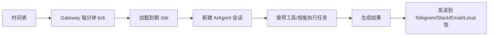

这让自动化从“脚本工程”变成“可对话配置的代理任务”。

### 为什么需要插件和 MCP

没有任何 Agent 能内置所有工具。Hermes 的扩展路径主要有两条：

| 扩展方式 | 适合场景 |
|---|---|
| Plugin | 给 Hermes 增加自定义工具、hook、slash command、平台适配、记忆提供方、上下文引擎 |
| MCP | 连接外部已经存在的工具服务器，如 GitHub、数据库、文件系统、内部 API |

插件解决“我想让 Hermes 变得更像我的系统”的问题。MCP 解决“我想让 Hermes 接入外部工具生态”的问题。

## Hermes 能做什么

### 1. 作为开发助手

Hermes 可以在项目目录中读取上下文文件、搜索代码、运行测试、修改文件、生成补丁、总结架构、写文档、做代码审查。

典型任务：

```text
帮我读一下这个项目，解释请求从 API 到数据库的完整路径。
```

```text
修复这个测试失败，并说明根因。
```

```text
给这个模块写一份面向新同事的 onboarding 文档。
```

价值在于：Hermes 不只是给出建议，它可以实际进入文件系统和终端环境完成工作。

### 2. 作为研究与知识整理助手

Hermes 有网页搜索、网页抽取、文件读写、技能系统和长期记忆，适合做研究工作流：

- 检索多个来源。
- 提取关键信息。
- 建立比较表。
- 生成学习笔记。
- 把稳定流程保存成技能。
- 定时追踪某个领域动态。

例如：

```text
每周一早上 9 点，帮我整理过去一周 AI Agent 相关的重要项目，发到 Slack。
```

这里涉及 Web、Cron、Messaging Gateway 和可能的 skill-backed workflow。

### 3. 作为个人自动化中枢

Hermes 可以处理“自然语言 + 定时 + 通知 + 工具”的场景：

- 定时巡检服务器。
- 读取日志并总结异常。
- 检查 GitHub PR 状态。
- 生成日报、周报。
- 监控 RSS、博客、新闻源。
- 和 Home Assistant、Spotify 等集成。

它的特点是自动化任务可以由 Agent 推理执行，不必每个场景都写死脚本。

### 4. 作为跨平台 AI 助手

通过 Gateway，你可以从不同聊天平台进入同一个 Hermes：

- 手机上用 Telegram 发“检查一下服务器状态”。
- 在 Slack 线程里让它总结讨论。
- 在 Discord 语音里和它对话。
- 通过 Email 收取定时报告。
- 在企业微信或飞书中使用团队场景能力。

这让 Agent 从“一个应用”变成“一个可被多入口唤起的服务”。

### 5. 作为可扩展工具平台

如果团队有内部系统，可以通过 MCP 或 Plugin 接入：

- 内部工单系统。
- 私有数据库查询。
- 部署平台。
- 数据看板。
- 文档库。
- 告警系统。

Hermes 的模型负责理解目标、选择工具、组织步骤；你的插件或 MCP 服务器负责把真实系统能力暴露给它。

## Hermes 解决的问题

### 问题一：上下文断裂

传统 AI 工具经常需要用户反复提供背景。Hermes 用项目 context files、记忆、会话存储和 session search 解决这个问题。

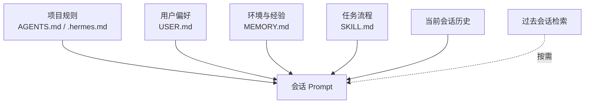

### 问题二：模型锁定

Hermes 支持多 provider、多模型、fallback 和 OpenAI-compatible endpoint。用户可以根据成本、速度、能力和可用性切换模型，而不重写工作流。

### 问题三：工具碎片化

很多 AI 工作流需要网页、终端、文件、浏览器、消息、语音、图像、外部 API。Hermes 把这些能力统一成工具注册和工具集机制，减少“在多个软件之间手工搬运”的成本。

### 问题四：经验无法沉淀

普通 Agent 完成一次复杂任务后，经验往往留在聊天记录里。Hermes 把经验分流到 Memory 和 Skills，并通过自我改进循环与 Curator 维护它们。

### 问题五：自动化和交付困难

Cron + Gateway 让 Hermes 可以在无人值守的情况下运行任务，并把结果交付到聊天平台、邮件或本地文件。这解决了“AI 只在打开窗口时可用”的问题。

### 问题六：部署环境受限

Hermes 的 terminal backend 可以是本机、Docker、SSH、Singularity、Modal、Daytona、Vercel Sandbox 等。它既可以在个人电脑上工作，也可以跑在便宜 VPS、云沙盒或远程服务器上。

## 教学案例：从“每日 AI 简报”理解 Hermes

假设你的目标是：

> 每天上午 9 点，Hermes 自动搜索 AI Agent 领域的新项目和重要文章，筛选出最值得看的 5 条，写成中文简报，发到 Telegram。

这个任务看似简单，实际涉及很多模块：

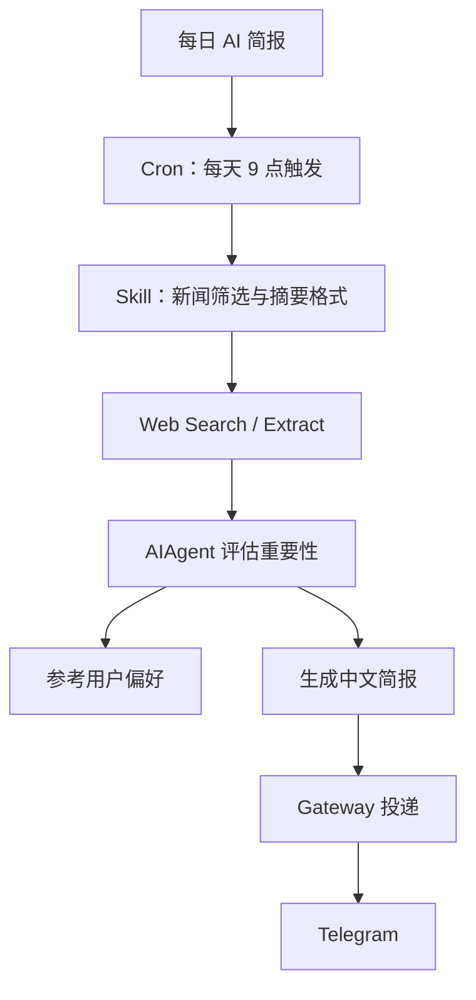

如果没有 Hermes，你可能需要：

- 写一个 Python 脚本搜索 RSS 或 API。
- 配置 crontab。
- 写 Telegram bot 发送逻辑。
- 单独管理 API key。
- 处理失败重试和日志。
- 手动调整筛选规则。

有 Hermes 后，你可以把任务描述给 Agent，让它创建 cron job，必要时附加一个 skill，并通过 gateway 投递。更进一步，如果你反复调整简报风格，Hermes 可以把偏好保存到 memory 或 skill 中。

这个例子体现了 Hermes 的核心价值：**它把一次任务背后的工程胶水变少，让用户更接近用自然语言表达目标。**

## 教学案例：从“代码仓库维护”理解 Hermes

另一个典型任务：

> 每周五下午检查一个项目：运行测试、查看最近提交、总结风险、生成下周建议，并把报告发到团队频道。

涉及模块：

| 模块 | 在任务中的作用 |
|---|---|
| Context Files | 读取项目规则、测试命令、贡献约定 |
| Terminal | 拉取状态、运行测试、检查构建 |
| Git / Files | 查看 diff、提交记录、关键文件 |
| SessionDB | 保留历史报告和讨论 |
| Cron | 每周定时触发 |
| Gateway | 把报告发到 Slack/Discord/飞书 |
| Skills | 固化“周度仓库巡检”流程 |
| Memory | 记住团队偏好、报告格式、重要路径 |

这种场景正是普通聊天机器人难以胜任的，因为它需要真实执行、长期重复、历史比较和外部交付。

## Hermes 的关键概念小词典

| 概念 | 简明解释 |
|---|---|
| AIAgent | Hermes 的核心会话循环，负责调用模型、处理工具调用、维护对话流程 |
| Provider | 模型供应商或模型后端，如 Nous Portal、OpenRouter、OpenAI、Anthropic、本地 endpoint |
| Tool | Agent 可调用的函数能力，如终端、文件、浏览器、搜索、记忆 |
| Toolset | 一组工具的集合，用于按平台或场景启用/禁用 |
| Skill | 可按需加载的任务知识文档，是流程型记忆 |
| Memory | Hermes 持久保存的用户偏好、项目事实和环境经验 |
| SessionDB | 保存会话历史的 SQLite 数据库，支持 FTS5 检索 |
| Gateway | 多聊天平台适配和后台消息服务 |
| Cron | Hermes 的定时任务系统，可运行 Agent 任务并投递结果 |
| Plugin | 扩展 Hermes 的机制，可添加工具、hook、命令、平台、记忆提供方等 |
| MCP | Model Context Protocol，用于连接外部工具服务器 |
| Context files | `.hermes.md`、`AGENTS.md`、`CLAUDE.md` 等项目说明文件 |
| SOUL.md | Hermes 实例的人格和语气文件 |
| Curator | 后台技能维护 Agent，用于整理、合并、修剪技能库 |

## 如何学习 Hermes：推荐路线

### 第一阶段：把它当 CLI 用

目标是熟悉基础交互：

1. 启动 `hermes` 或 `hermes --tui`。
2. 使用 `/help`、`/model`、`/tools`、`/usage`。
3. 在一个项目目录里让它解释结构。
4. 让它读文件、总结模块、运行一个安全命令。

这一阶段重点是理解“Agent 如何和本地环境互动”。

### 第二阶段：理解上下文和记忆

练习：

1. 在项目里写一个简短 `AGENTS.md`。
2. 观察 Hermes 如何遵守项目规则。
3. 让 Hermes 记住一个偏好。
4. 新会话中验证记忆是否影响行为。
5. 使用 session search 找过去讨论。

这一阶段重点是理解“长期协作需要信息分层”。

### 第三阶段：使用技能

练习：

1. 查看已有 skills。
2. 运行一个 skill slash command。
3. 写一个简单 SKILL.md。
4. 让 Hermes 在复杂任务后更新技能。

这一阶段重点是理解“经验如何从聊天记录变成可复用流程”。

### 第四阶段：配置 Gateway 和 Cron

练习：

1. 配置一个消息平台。
2. 设置 home channel。
3. 创建一个简单定时提醒。
4. 创建一个带搜索或项目检查的 cron job。
5. 观察输出投递与日志。

这一阶段重点是理解“Agent 如何从交互式工具变成后台服务”。

### 第五阶段：扩展 Hermes

练习：

1. 配置一个 MCP server。
2. 写一个最小插件，注册一个 hello tool。
3. 尝试 plugin hook 记录工具调用。
4. 研究 memory provider 或 context engine 的扩展方式。

这一阶段重点是理解“Hermes 如何接入你的组织系统”。

## 课堂练习

### 练习一：画出你的个人 Hermes 架构

请根据自己的使用环境，画一张图：

- 你会从哪些入口使用 Hermes？
- 你希望它连接哪些模型？
- 你希望启用哪些工具？
- 哪些任务适合 cron？
- 哪些经验应沉淀成 memory？
- 哪些流程应沉淀成 skill？

参考模板：

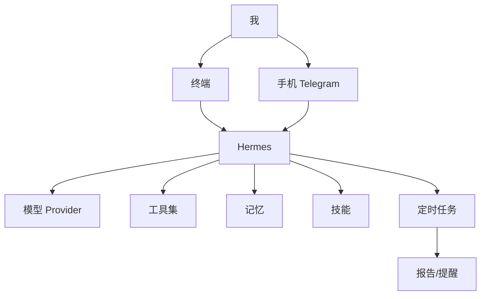

### 练习二：判断哪些内容应该进入 Memory

判断下列信息应保存到 `memory`、`user`、`skill`，还是不保存：

| 信息 | 建议归类 | 原因 |
|---|---|---|
| 用户喜欢中文回答，但代码注释用英文 | user | 影响长期沟通风格 |
| 某项目测试命令是 `uv run pytest` | memory | 项目事实，高频复用 |
| 今天临时生成的 `/tmp/report-123.md` | 不保存 | 一次性上下文 |
| 发布 npm 包需要先跑 lint、test、changeset、tag | skill | 流程型知识 |
| 某次报错日志的完整 2000 行输出 | 不保存 | 体积大，适合留在文件或会话 |

### 练习三：把一个重复任务改写成 Hermes Cron

选择一个你每周都做的任务，写成自然语言：

```text
每周五 17:00，在项目 /path/to/project 中运行测试，查看过去一周提交，
总结风险和下周建议，报告发到 Slack #engineering。
```

然后拆解：

- 需要哪个 workdir？
- 需要哪些 toolsets？
- 是否需要 skill？
- 输出发到哪里？
- 成功时是否静默？
- 失败时要如何提醒？

### 练习四：设计一个 Hermes Skill

为你的工作流写一个 skill 大纲：

```markdown
---
name: weekly-repo-audit
description: 每周仓库巡检：测试、提交、风险和建议
version: 1.0.0
---

# Weekly Repo Audit

## When to Use

当用户要求检查一个仓库的近期健康状况时使用。

## Procedure

1. 读取项目上下文。
2. 查看 git 状态和最近提交。
3. 运行测试。
4. 检查失败、TODO、依赖变更。
5. 输出风险、建议和下周行动项。

## Verification

报告中必须包含测试命令、测试结果、commit 范围和未解决风险。
```

重点不是格式，而是理解：Skill 让 Agent 以后不必重新发明这个流程。

## 常见误区

### 误区一：Hermes 等于一个模型

Hermes 不是模型。它是模型之上的 Agent 运行系统。模型负责语言和推理，Hermes 负责上下文、工具、会话、运行环境、平台、自动化和扩展。

### 误区二：工具越多越好

工具越多，能力越强，但也越难管理。生产使用时应按平台和任务启用必要工具，尤其注意终端、文件、消息发送、插件 hook 等高影响能力。

### 误区三：Memory 应该保存一切

Memory 不是数据库。它应该保存少量高价值事实。大段信息、临时数据、日志和文档应该放在文件、会话历史或外部知识库中。

### 误区四：Skill 是普通文档

Skill 不是随便写的笔记，而是给 Agent 用的操作说明。好的 Skill 应该有触发条件、步骤、验证方式、常见坑和必要的脚本/模板。

### 误区五：Cron 就是 crontab

Hermes Cron 的关键不是“按时间执行命令”，而是“按时间启动一个有工具、有技能、能推理、能投递结果的 Agent 会话”。

## 安全与边界

Hermes 的能力越强，越需要安全意识。

### 终端和文件权限

如果启用 terminal 和 file 工具，Hermes 就可能执行命令和修改文件。建议：

- 在不信任任务中使用 Docker、SSH 或云沙盒后端。
- 对危险命令保持审批。
- 不要把生产密钥暴露给不必要的工具环境。
- 对自动化任务设置清晰范围。

### 消息网关权限

Gateway 默认应该使用 allowlist 或 DM pairing。不要把带终端能力的 bot 暴露给所有人。

### 插件安全

插件可以注册工具和 hook，能力很强。只启用可信插件；项目本地插件尤其要谨慎，因为它们可能来自仓库内容。

### 记忆污染

Memory 和 Context files 会进入提示词，因此要防止恶意提示注入。Hermes 有安全扫描，但共享仓库中的上下文文件仍应人工审查。

### 自动化失控

Cron 任务应避免递归创建任务、无限通知、无边界搜索和过高成本模型。好的 cron prompt 应说明成功/失败输出策略，必要时使用 `[SILENT]` 抑制健康状态噪音。

## 和其他工具的关系

Hermes 与常见 AI 工具不是简单替代关系：

| 工具类型 | 典型优势 | Hermes 的差异 |
|---|---|---|
| ChatGPT/网页聊天 | 易用、模型强、适合问答 | Hermes 更强调工具执行、长期记忆、后台运行和多平台 |
| IDE Agent | 贴近代码编辑 | Hermes 覆盖 CLI、Gateway、Cron、插件、MCP、部署环境 |
| 自动化脚本 | 稳定、可控、低成本 | Hermes 更适合开放式、需要推理和多工具组合的任务 |
| Slack/Telegram bot | 入口方便 | Hermes 不是单平台 bot，而是多平台共用 Agent 后端 |
| 工作流平台 | 节点可视化、流程固定 | Hermes 更适合自然语言驱动的动态任务 |

一个实用判断是：

- 如果任务规则稳定、输入输出固定，用脚本或工作流平台更可靠。
- 如果任务需要阅读、判断、搜索、总结、修复、跨工具组合，Hermes 更合适。
- 如果任务高风险、强合规、强确定性，Hermes 应作为辅助，而不是无监督执行者。

## 总结：Hermes 的本质价值

Hermes 的核心不是“多一个 AI 聊天入口”，而是把 Agent 需要的长期工作能力组合在一起：

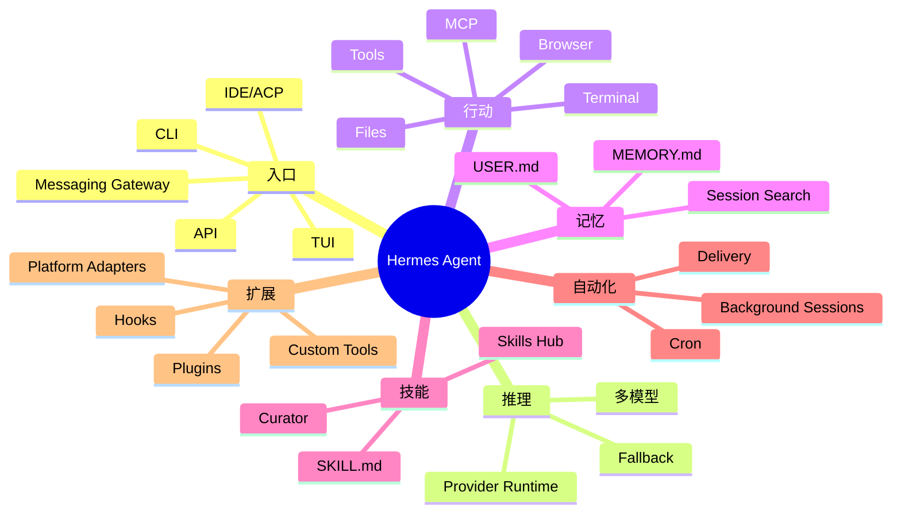

从个人角度看，Hermes 让你拥有一个可以长期协作、能记住偏好、能跨平台触达、能自动执行任务的 AI 工作伙伴。

从工程角度看，Hermes 展示了现代 Agent 系统的一种完整形态：模型只是核心部件之一，真正的产品能力来自模型、上下文、工具、状态、权限、平台和反馈循环的系统组合。

从学习角度看，Hermes 是理解下一代 AI Agent 的优秀案例。它把许多抽象概念落到了具体实现中：工具调用、上下文工程、持久记忆、技能系统、消息网关、MCP、插件架构、自动化调度、自我改进和多环境部署。

如果只能记住一句话：

**Hermes 的目标不是让 AI 回答更多问题，而是让 AI 更稳定地参与真实工作，并在长期使用中沉淀经验、扩展能力、持续变得更懂你。**

## 延伸阅读建议

如果后续要把本课题扩展成系列课程，可以继续拆成以下章节：

1. Hermes 安装与第一次会话：从 CLI 到 TUI。
2. Hermes 架构详解：AIAgent、Prompt Builder、Tool Runtime。
3. 工具系统实战：terminal、file、browser、web、execute_code。
4. Memory 与 Session Search：如何设计可持续记忆。
5. Skill 编写方法：从一次经验到可复用能力。
6. Gateway 实战：把 Hermes 接到 Telegram、Slack、飞书或企业微信。
7. Cron 实战：构建日报、巡检、监控和研究自动化。
8. MCP 与插件开发：把 Hermes 接入内部系统。
9. 安全实践：权限、沙盒、allowlist、插件审查和自动化边界。
10. Agent 产品设计：从 Hermes 看长期协作型 AI 的系统要素。

## 本文参考的本地资料

本文基于当前工作区旁边的 `/Users/chenmeili/Documents/GitHub/hermes-agent` 本地资料整理，主要参考：

- `README.md`：产品定位、主要能力、安装与入口。
- `website/docs/developer-guide/architecture.md`：内部架构、目录结构、数据流与主要子系统。
- `website/docs/user-guide/features/overview.md`：功能总览。
- `website/docs/user-guide/features/tools.md`：工具与工具集。
- `website/docs/user-guide/features/memory.md`：持久记忆与会话搜索。
- `website/docs/user-guide/features/skills.md`：技能系统与 Skills Hub。
- `website/docs/user-guide/features/cron.md`：定时任务。
- `website/docs/user-guide/messaging/index.md`：消息网关。
- `website/docs/user-guide/features/plugins.md`：插件系统。
- `website/docs/user-guide/features/mcp.md`：MCP 集成。
- `RELEASE_v0.12.0.md`：Curator、自我改进循环、Provider、Gateway、插件和 TUI 等近期演进。

## 相关阅读

- [OpenCode 插件：从一个通知开始](../opencode-plugins-tutorial/index.md)
- [从 sub-agent 到 agent-team：三个台阶，三套心智模型](../claude-sub-agent/sub-agent-and-agent-team.md)
- [AI 时代，什么才是稀缺能力](../ai-era-scarce-abilities/index.md)
